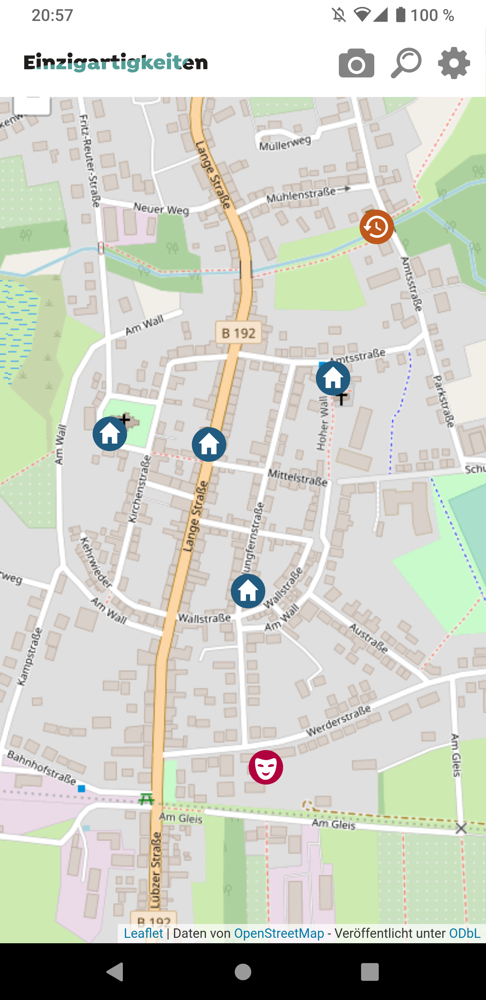

# ExceptionalMapApp

This is a work-in-progress app for displaying points of interest around Goldberg, Germany.

It is based on data of the (not yet published) public API of this customer.

It is a spare-time project endorsed by my current employer that I mainly use to get familiar with React Native, Expo. My main goal is figuring out how to build a cross-platform app for iOS and Android.

Feel free to use this as a starting point if you're also a newcomer in this field.